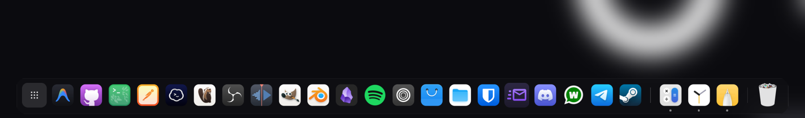
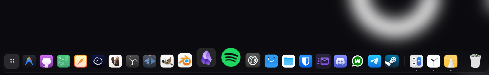
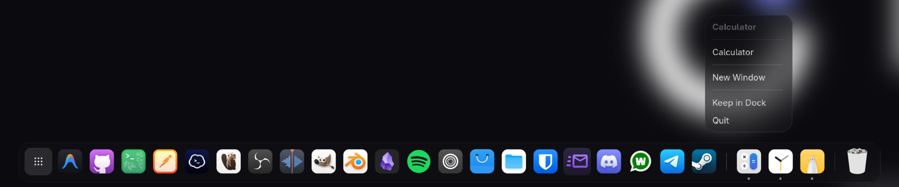

# Glass Dock for GNOME

A frosted-glass dock for GNOME with macOS-style magnification, bouncing launches,
badges and smart auto-hide. It shares its look with
[Dynamic Island](https://github.com/HIMURAw/gnome-dynamic-island), and works on its own
just as well.

<p align="center"></p>

<p align="center"></p>

## What it does

- **Magnification:** icons grow under the pointer like a wave, and the dock widens
  with them. Only the icon texture is scaled, so it stays smooth.
- **Pinned and open apps:** your favourites, then the other open apps after a thin
  separator, then the trash. Apps coming and going grow in and shrink away.
- **Dots** under an icon show its open windows; the active app's dot is wider.
- **Launches bounce**, and an app asking for attention bounces twice.
- **Badges and progress:** unread counts and progress bars that apps publish through the
  LauncherEntry API (Telegram, for example).
- **Click** an app to open or focus it, click again to minimize it (or go round its
  windows when it has several). **Middle-click** opens a new window. **Scroll** over an
  icon to switch between its windows.
- **Right-click** for its windows, its actions (New Private Window and so on), Keep in
  Dock or Remove from Dock, and Quit.

  

- **Drag** icons to reorder them, drag apps in from the app grid to pin them, and drag
  a pinned icon well above the dock and let go to remove it.
- **Show Apps** on the left opens the app grid; the **trash** on the right shows whether
  it is full and opens it.
- **Out of the way:** in fullscreen, or when a window reaches down under it, the dock
  slides down. Rest the pointer on the bottom edge to bring it back. In the overview it
  steps aside for GNOME's own dash. Desktop icons keep clear of it.

The text follows your system language.

## Install

From source:

```bash
git clone https://github.com/HIMURAw/gnome-glass-dock.git
cd gnome-glass-dock
./install.sh
```

Or download `glass-dock@himuraw.shell-extension.zip` from the
[latest release](https://github.com/HIMURAw/gnome-glass-dock/releases/latest) and run:

```bash
gnome-extensions install --force glass-dock@himuraw.shell-extension.zip
gnome-extensions enable glass-dock@himuraw
```

Then log out and back in: on Wayland GNOME only loads new extensions at login.

If you use another dock (Dash to Dock, Dash2Dock Animated, Ubuntu Dock), turn it off
first, or the two will sit on top of each other.

## Settings

**Extensions → Glass Dock → Settings**, or `gnome-extensions prefs glass-dock@himuraw`:

- icon size and how much icons magnify (or no magnification)
- frosted glass or a plain dark dock for slower graphics
- which monitor
- slide out of the way: never (windows stay above the dock), in fullscreen, or also when
  a window reaches under it
- whether clicking the active app minimizes it
- Show Apps button, open apps that are not pinned, trash, badges and progress

Changes apply straight away.

## Requirements

GNOME Shell 50. Earlier versions are not tested yet; reports and pull requests are
welcome.

## Troubleshooting

- **Nothing changed after installing:** log out and back in.
- **Two docks:** turn the other dock extension off.
- **Log:** `journalctl -b -o cat /usr/bin/gnome-shell | grep -i -A5 "glass dock"`

## Development

Test in a nested session so you do not have to log out:

```bash
sudo dnf install mutter-devkit   # Fedora
./build.sh locale                # compiles translations and settings schemas
dbus-run-session gnome-shell --devkit --wayland
```

After a nested session that was killed rather than quit, delete
`/run/user/$UID/gnome-shell-disable-extensions` if it is there, or your next login
starts with extensions off. Settings and pinned apps are shared with your real session.

- `npm install && npx eslint .` lints the code; CI runs the same on every push.
- `./build.sh pack` builds the zip for extensions.gnome.org.
- `./build.sh pot` refreshes the translation template after changing strings.
- Pushing a tag like `v1.1` publishes a GitHub release with the zip.

## Translating

Copy `po/glass-dock@himuraw.pot` to `po/<language>.po`, fill in the `msgstr` lines and
open a pull request. Available: English, Turkish.

## License

GPL-3.0-or-later
